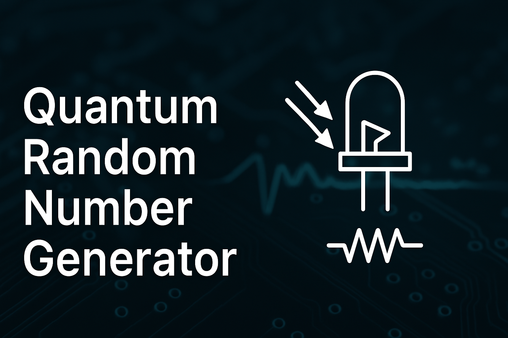
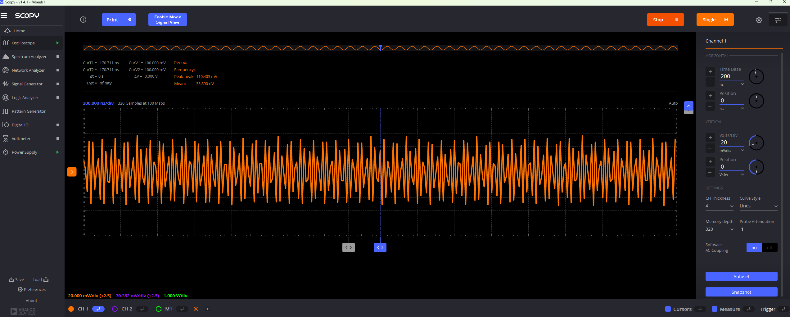
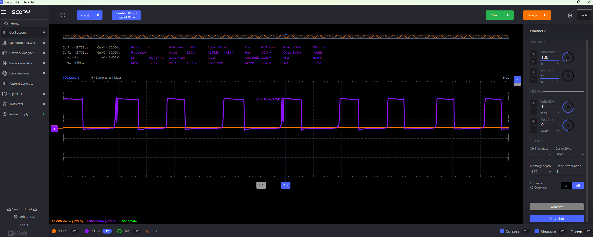

# Quantum-RNG: A Low-Cost Hardware Quantum Random Number Generator

This was my final project for my university circuits class — I set out to build something unconventional and ambitious: a **quantum random number generator** based on analog shot noise from a photodiode, sampled by a Raspberry Pi Pico. The idea was simple: take something theoretical, and **make it real** using only hardware.

I built, tuned, and tested this entire project in about **two days**. Everything was done using discrete components and low-cost ICs I already had — no fancy op-amps or high-speed comparators. Despite the rushed timeline and limited parts, I think the results turned out surprisingly well.

Compare real-world quantum noise vs. Python/Numpy pseudo-random number generators — and see how far raw hardware can go.

---
## Why Quantum Randomness?

Traditional pseudo-random number generators (PRNGs), while useful for many tasks, are ultimately deterministic. They rely on algorithms and an initial seed value. If that seed is known or guessed, the entire output stream can be predicted. Additionally, all PRNGs eventually cycle and repeat after a sufficiently long sequence, which may compromise security or unpredictability in sensitive applications.

A quantum random number generator (QRNG) like this one leverages the physical randomness of the universe. Specifically, it uses **shot noise** — a quantum phenomenon where current arrives in discrete packets (electrons), creating inherent randomness due to the probabilistic nature of quantum mechanics. When a photodiode is reverse-biased, these random arrival times generate a measurable current with statistical fluctuations. This becomes the true entropy source in the system.

This project captures that analog noise, amplifies it, and then digitizes it to produce high-quality, non-deterministic binary data that cannot be predicted or reproduced by algorithmic means.

## What Makes This Unique

- **All tuning was done on the hardware side**  
  No post-processing, no filters, no whitening. Just analog noise, amplification, and digital sampling.
  
- **Entropy results were remarkable**  
  Most of my tests showed entropy errors around **~1%**, and my best run scored a **0.0048%** error — actually outperforming the engineered PRNGs I compared against.

- **Bit transitions were a known weakness**  
  My QRNG sometimes struggled with **long runs of repeated bits**, likely due to **comparator propagation delay** or bandwidth limitations in the op-amp. I’m not 100% sure, but I suspect faster analog parts would improve it.

- **Built fast with basic parts**  
  I didn’t have time to source ideal high-bandwidth op-amps or ultra-fast comparators. I used what I had — and still got a working, feasible prototype.

- **Optional 3D Enclosure + EMI Shield**  
  I also modeled a basic 3D-printed enclosure for the project and lined it with a copper EMI shield and grounded it to help reduce electromagnetic interference and noise pickup from the environment. You don’t need the enclosure to run the project, but the CAD files and details are available in `/enclosure_cad/` if anyone wants to use or remix it.

---

## Hardware

| Component           | Part # / Notes              |
|---------------------|-----------------------------|
| Raspberry Pi Pico   | or Pico W                   |
| Photodiode          | BPW34 (or equivalent)       |
| Op-Amp              | LM4562NA (gain ~2001x)      |
| Comparator          | LM393 or LT1011             |
| Resistors & Caps    | For gain tuning & filtering |
| USB Cable           | Data + power                |
| Breadboard & Wires  | For easy prototyping        |

Power: 5V via USB  
Sampling Rate: 5–15kHz (empirically tested)

---

## Circuit Diagram

See `/circuit_diagram/QRNG_Schematic.png`  
Includes LTSpice simulation output

---
### Why Green LEDs?

We used green LEDs in close proximity to the photodiode to emit photons and stimulate shot noise. Green was specifically chosen due to its photon energy falling within the BPW34 photodiode's peak sensitivity range. While blue LEDs have higher photon energy, their wavelength exceeds the spectral response of the BPW34, making green the most effective choice for this configuration.

## How It Works

1. **Photodiode** generates shot noise under reverse bias  
2. **Op-Amp** amplifies the analog signal (~2000x gain)  
3. **Comparator** digitizes the noise into 1s and 0s  
4. **Pico** samples the output and streams it over USB  
5. **Python** logs the data and analyzes it  

No digital filtering, no post-processing — just raw entropy.

### Shot Noise Observed on Oscilloscope

This is what the raw analog signal looked like coming from the photodiode amplified by a gain of x2001 before it was digitized by the comparator.

### Digitized Output from Comparator

This shows the same signal sent through the comparator. Notice the square-wave behavior representing bit transitions.

---

## Software

### `/pico_src/QRNG.c`
- Written in C for the Raspberry Pi Pico for low overhead and efficient timing 
- Samples a GPIO pin at high speed  
- Streams raw bits over USB serial

### `/python_analysis/RNGComp.py`
- Reads from serial and logs data to `.csv`  
- Analyzes bit distribution and entropy  
- Compares against:
  - Python `random`  
  - NumPy `random`  

---

## Results

I ran multiple tests against both Python's `random.getrandbits()` and NumPy's `random.randint()` functions. My QRNG typically showed around **0.7793% entropy error**, and on one occasion achieved an outstanding result with only **0.0048% error**, outperforming both software PRNGs.

Below are two sets of results from actual runs:

### Typical QRNG Output

| Metric                    | QRNG            | Python PRNG     | NumPy PRNG      |
|---------------------------|------------------|------------------|------------------|
| Total 0s                  | 496,326          | 499,986          | 500,401          |
| Total 1s                  | 504,122          | 500,014          | 499,599          |
| Frequency imbalance       | 0.7793%          | 0.0028%          | 0.0002%          |
| Shannon entropy           | 0.999956 bits/bit| 1.000000 bits/bit| 1.000000 bits/bit|
| Bit transitions           | 36.99%           | 49.94%           | 50.06%           |
| Longest repeated bit run  | 23               | 20               | 20               |

---

### Best QRNG Output

| Metric                    | QRNG (Best Case) | Python PRNG     | NumPy PRNG      |
|---------------------------|------------------|------------------|------------------|
| Total 0s                  | 500,200          | 499,958          | 499,119          |
| Total 1s                  | 500,248          | 500,042          | 500,881          |
| Frequency imbalance       | 0.0048%          | 0.0084%          | 0.1762%          |
| Shannon entropy           | 1.000000 bits/bit| 1.000000 bits/bit| 0.999998 bits/bit|
| Bit transitions           | 19.20%           | 50.05%           | 50.07%           |
| Longest repeated bit run  | 82               | 18               | 25               |

> Note: My QRNG occasionally struggles with bit transitions and longer streaks of identical bits. This is likely due to comparator propagation delay or limited bandwidth in the op-amp used. Higher-quality components would likely improve this further.

---

## Future Work

- Replace comparator with faster alternative  
- Use a higher GBW op-amp for better fidelity  
- Add whitening/filtering step in software  
- Run NIST STS or Dieharder randomness tests  
- Build PCB version  
- Make a USB keyboard that "types" secure random strings  

---

## Contributing & Feedback

I just wanted to share my findings and build something cool for class. If you have feedback, criticism, or ideas to improve this, I’m all ears.

Feel free to:
- Open an issue
- Suggest hardware improvements
- Fork and remix it

I’d love to hear how others would refine this or take it further.

---

## Keywords

quantum random number generator, QRNG, shot noise, photodiode, pico, microcontroller, randomness, entropy, PRNG, numpy, raspberry pi hardware project, electrical engineering, true randomness, op-amp noise, propagation delay, comparator, diy rng

---

## License

MIT License — see [LICENSE](LICENSE)

